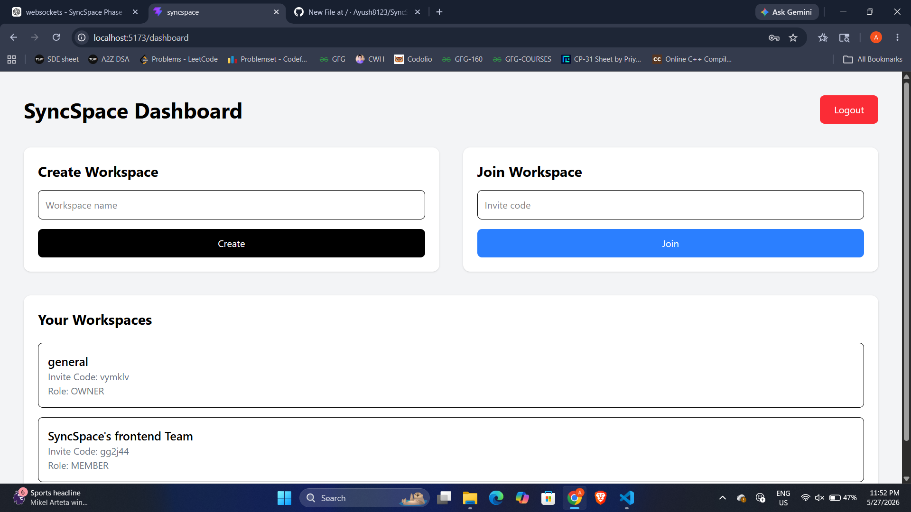
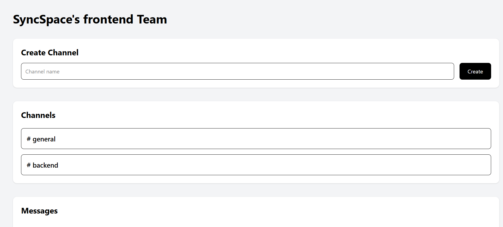
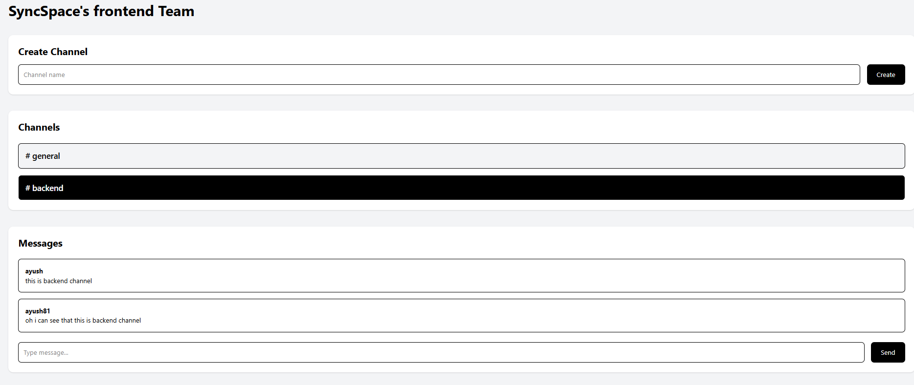

# SyncSpace

SyncSpace is a realtime team collaboration platform inspired by Slack and Discord, built to deeply explore WebSocket architecture and scalable backend system design.

The project focuses on understanding how realtime systems work internally using Socket.IO, PostgreSQL, Prisma ORM, and event-driven communication patterns.

---

# Features

## Authentication

* JWT-based authentication
* Secure signup/login system
* Protected frontend and backend routes
* Password hashing using bcrypt

## Workspace System

* Create workspaces
* Join workspaces using invite codes
* Workspace membership architecture
* Role-based membership design

## Channel System

* Create channels inside workspaces
* Channel-specific communication architecture
* Dynamic workspace/channel routing

## Realtime Messaging

* Persistent realtime messaging using Socket.IO
* Channel-based socket room architecture
* Instant message synchronization across users
* Database-backed message history

---

# Tech Stack

## Frontend

* React
* Tailwind CSS
* Socket.IO Client

## Backend

* Node.js
* Express.js
* Socket.IO
* JWT Authentication

## Database

* PostgreSQL
* Prisma ORM

---

# Realtime Architecture

SyncSpace uses a hybrid communication model:

## HTTP APIs

Used for:

* Authentication
* Workspace/channel creation
* Fetching history and initial data

## WebSockets (Socket.IO)

Used for:

* Live messaging
* Realtime synchronization
* Socket room communication

### Socket Room Architecture

Workspace channels map directly to Socket.IO rooms:

channelId ↔ socket room

This allows efficient realtime broadcasting only to users inside the active channel.

---

# Database Design

The application uses a relational PostgreSQL schema with normalized relationships.

Core entities:

* User
* Workspace
* WorkspaceMember
* Channel
* Message

Key architectural concepts:

* Many-to-many workspace membership
* Foreign key relationships
* Cascading deletes
* UUID-based IDs
* Transaction-safe relational modeling

---

# Screenshots

## Dashboard



## Workspace Page



## Realtime Messaging



---

# Installation

## Clone Repository

```bash
git clone YOUR_REPOSITORY_URL
cd syncspace
```

---

# Backend Setup

```bash
cd backend
npm install
```

Create `.env` file:

```env
DATABASE_URL=your_postgres_url
JWT_SECRET=your_secret
PORT=5000
```

Run Prisma migrations:

```bash
npx prisma migrate dev
```

Start backend:

```bash
npm run dev
```

---

# Frontend Setup

```bash
cd frontend
npm install
npm run dev
```
